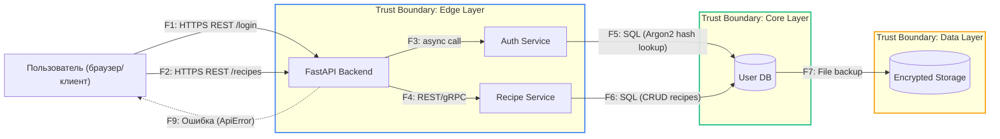

# Data Flow Diagram (DFD)

## Основной сценарий: взаимодействие клиента с API рецептов

| ID | Поток/действие        | Канал                  | Краткое описание                  |
| -- | --------------------- | ---------------------- | --------------------------------- |
| F1 | POST /login           | HTTPS                  | Передача логина и пароля          |
| F2 | GET /recipes          | HTTPS                  | Получение списка рецептов         |
| F3 | API → AuthService     | внутренний async вызов | Проверка JWT/сессии               |
| F4 | API → RecipeService   | gRPC/REST              | CRUD операции над рецептами       |
| F5 | AuthService → UserDB  | SQL                    | Проверка пароля                   |
| F6 | RecipeService → DB    | SQL                    | Чтение/запись рецептов            |
| F7 | DB → Backup           | файловый канал         | Бэкап базы данных                 |
| F9 | Ответ с ошибкой       | HTTPS                  | Формат JSON, обёрнутый в ApiError |
